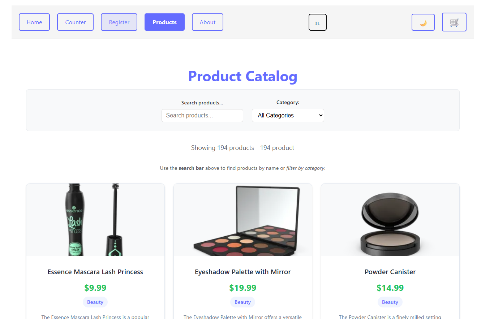
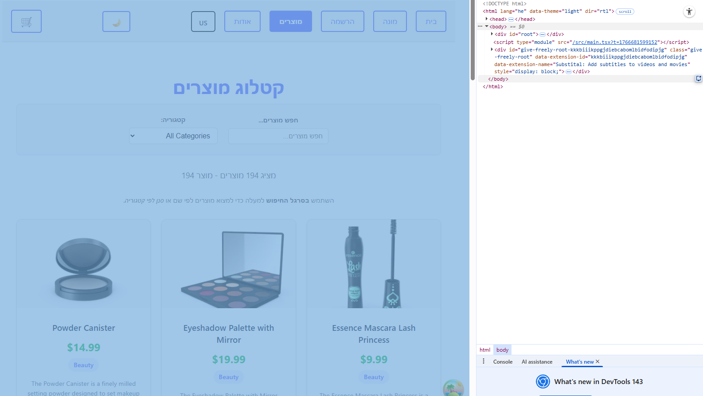
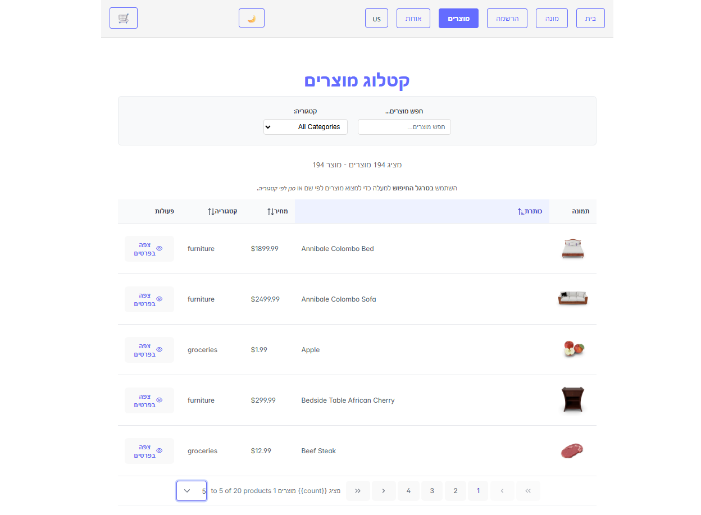
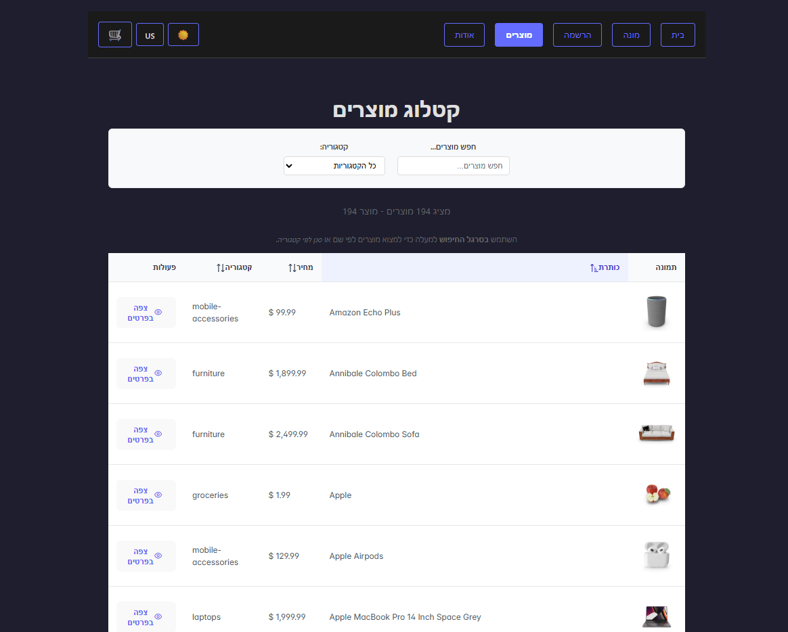
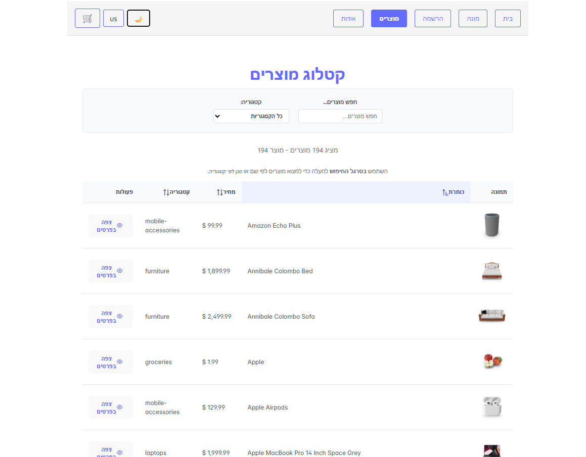

# React Store App - Advanced Homework 4

## Student Submission

**Course:** React Advanced - i18n & Component Libraries  
**Assignment:** Homework 4 - i18n with PrimeReact  
**Starting Point:** Commit `633728e21735d64303a10096d5d51d6bf8e7b195`  
**API Used:** DummyJSON (https://dummyjson.com)

---

## Step 0 - Prep (Path A)

✅ **Products list page** works correctly (TanStack Query at `/products`)  
✅ **Product detail page** works correctly (TanStack Query at `/products/:id`)  
✅ **API base URL** confirmed: https://dummyjson.com

### Technologies Stack

- React 18 + TypeScript
- Vite (Build tool)
- TanStack Query (Server state management)
- React Router (Navigation)
- Zustand (Client state management)
- i18next + react-i18next (Internationalization)
- PrimeReact + PrimeIcons (UI component library)

---

## Step 1 - i18n Setup

**Locales:** English (en), Hebrew (he)  
**Namespaces:**
- `common` - header, buttons, generic UI labels
- `products` - catalog/list/detail strings

**Features:**
- Automatic RTL support for Hebrew
- Language persistence in localStorage (key: `app_lang`)
- Interpolation support (e.g., "Showing {{count}} products")
- Pluralization support (e.g., "1 product" vs "2 products")

**Screenshots:**

English (LTR):


Hebrew (RTL):


## Step 2 - i18n Implementation

**Required Features Demonstrated:**

1. **Interpolation** - `products:showing` key: "Showing {{count}} products"
   - Location: Products list page (ProductsPage.tsx)
   - Dynamically inserts the total product count

2. **Pluralization** - `products:productCount` key: "{{count}} product" / "{{count}} products"
   - Location: Products list page (ProductsPage.tsx)
   - Automatically switches between singular and plural forms

3. **Trans Component** - `products:searchInfo` key with embedded formatting
   - Location: Products list page (ProductsPage.tsx)
   - Uses `<Trans>` to embed `<strong>` and `<em>` tags within translated text

**Translated Components:**
- Navigation (header links, language switcher)
- Products list page (all UI strings, loading, error states)
- Product detail page (all UI strings, loading, error states)

## Step 3 - Language Switcher + Persistence

**Language Switcher:** Flag button (🇮🇱/🇺🇸) in navigation header toggles between English and Hebrew.

**How Language Persistence Works:**

When the application initializes, i18n checks localStorage for a saved language preference using the key `app_lang`. If a saved language is found, it loads that language; otherwise, it defaults to English. When a user clicks the language switcher button, the app immediately changes the active language and updates the UI in real-time. At the same time, an event listener automatically saves the new language choice to localStorage and updates the document's text direction (LTR for English, RTL for Hebrew) and language attribute. This ensures that when the user refreshes the page or returns later, their language preference is restored automatically.


## Step 4 - RTL Mode

**RTL Support:** Implemented for Hebrew language with automatic direction switching.

**Implementation:**
- When Hebrew is active: `document.documentElement.dir = "rtl"` and `document.documentElement.lang = "he"`
- Automatically reverts to LTR when English is selected
- Handled via i18n `languageChanged` event listener

**RTL Layout Fixes:**

1. **Text alignment issue → Fix:** All text content automatically aligns to the right in RTL mode. Product cards, navigation links, and form inputs properly mirror their layout direction.

2. **Navigation button order issue → Fix:** Language switcher and cart buttons maintain proper visual order in RTL layout. The flag button and cart icon are positioned correctly on the left side in RTL mode (right side in LTR).

**Screenshot:** See Hebrew screenshot above showing RTL layout with right-aligned text, mirrored navigation, and proper Hebrew text rendering.




---
## Step 5 - PrimeReact Setup + DataTable Conversion

**Packages Installed:**
- `primereact` - UI component library
- `primeicons` - Icon library

**CSS Configuration:**
In `main.tsx`, added PrimeReact CSS imports:
```typescript
import 'primereact/resources/themes/lara-light-indigo/theme.css' // Theme
import 'primereact/resources/primereact.min.css' // Core CSS
import 'primeicons/primeicons.css' // Icons
```

**DataTable Implementation:**

Replaced the products card grid with PrimeReact DataTable component. The table is driven directly by TanStack Query data and includes:

**Columns:**
1. **Image** - Custom cell template displaying product thumbnail (80x80px with rounded corners)
2. **Title** - Product name (sortable)
3. **Price** - Formatted price with $ symbol (sortable)
4. **Category** - Product category (sortable)
5. **Actions** - "View Details" button with eye icon that navigates to product detail page

**DataTable Features Implemented:**

1. ✅ **Sorting** - Enabled on Title, Price, and Category columns. Users can click column headers to sort ascending/descending. Default sort is by title in ascending order.

2. ✅ **Pagination** - Built-in DataTable paginator with:
   - Rows per page options: 5, 10, 20
   - Default: 10 rows per page
   - Navigation: First, Previous, Page links, Next, Last
   - Current page report showing "Showing X to Y of Z products"

**Screenshot:**




---

## Step 6 - PrimeReact Theme Switch + Persistence

**Theme Switcher Implementation:**

Added a theme toggle button (🌙/☀️) in the navigation header that switches between PrimeReact themes:
- **Light Theme**: `lara-light-indigo` - Default, clean light theme with indigo accents
- **Dark Theme**: `lara-dark-indigo` - Dark mode with indigo accents for reduced eye strain

**Dynamic Theme Loading:**

The theme system uses dynamic CSS loading to switch PrimeReact themes at runtime:
- Theme CSS link is created dynamically in `main.tsx` with `id="primereact-theme"`
- `themeStore.ts` contains a helper function that updates the link's `href` attribute
- When theme toggles, all PrimeReact components (DataTable, Buttons, Inputs) immediately reflect the new theme

**Persistence Mechanism:**

- **localStorage Key**: `app_theme`
- **Default Theme**: `lara-light-indigo` (Light mode)
- **Storage Format**: Zustand persist middleware automatically saves the entire theme state
- On application load, `main.tsx` reads `app_theme` from localStorage and applies the saved theme before React renders
- Theme preference survives page refreshes and browser restarts

**Theme Store (Zustand):**

Located in `src/stores/themeStore.ts`, manages:
- Current theme state (`light` or `dark`)
- Current PrimeReact theme name
- `toggleTheme()` function that switches themes and updates localStorage
- Automatic CSS updates via `updatePrimeThemeCSS()` helper function

**Screenshots:**

Dark Theme (lara-dark-indigo):


Light Theme (lara-light-indigo):


**Implementation Notes:**

The theme switcher affects all PrimeReact components throughout the application, including:
- DataTable headers, cells, and pagination controls
- Buttons (View Details, pagination buttons)
- Input fields and select dropdowns
- All other PrimeReact UI elements maintain consistent theming

---

## Bonus Tasks

### Bonus A: Locale-Aware Price Formatting

**Implementation:** Added `Intl.NumberFormat` to the price column in the DataTable. Prices are now formatted according to the active locale:

```typescript
const priceBodyTemplate = (product: Product) => {
  const locale = i18n.language === 'he' ? 'he-IL' : 'en-US';
  const formatter = new Intl.NumberFormat(locale, {
    style: 'currency',
    currency: 'USD',
    minimumFractionDigits: 2,
    maximumFractionDigits: 2,
  });
  return <span>{formatter.format(product.price)}</span>;
};
```

**Result:**
- English (en-US): Displays as `$4.99` (dollar sign before amount)
- Hebrew (he-IL): Displays as `4.99 US$` (dollar sign after amount, RTL formatting)

This ensures prices are culturally appropriate for each language, following local conventions for currency display.

### Bonus B: Thorough Translation Coverage

**Implementation:** All UI strings in the products page are now fully translated with no hardcoded English text:

**Added Translation Keys:**
- `allCategories` - Category dropdown default option
- `clearFilters` - Button to reset search/category filters
- `searchFor` - Display text for active search query
- `inCategory` - Display text for active category filter

**Coverage:**
- ✅ All buttons (Clear Filters, View Details, pagination)
- ✅ All dropdowns and options (All Categories, category names)
- ✅ All status messages (loading, error states)
- ✅ All labels and descriptions (search, category, product count)
- ✅ Dynamic content (search query display, category display)

**Result:** The entire application has zero hardcoded English strings. Every piece of text is properly internationalized and displays correctly in both English and Hebrew, including interpolated values and pluralization.

---

## Summary

This homework demonstrates a complete implementation of internationalization (i18n) and PrimeReact integration in a React TypeScript application:

✅ **All 6 required steps completed**  
✅ **Both bonus tasks completed**  
✅ **Professional UI with full RTL support**  
✅ **Comprehensive translation coverage**  
✅ **Theme persistence and switching**  
✅ **Production-ready code structure**

Total implementation includes:
- 2 languages (English, Hebrew with RTL)
- 2 namespaces for organized translations
- Dynamic theme switching with persistence
- Locale-aware price formatting
- Fully translated UI with zero hardcoded strings
- Professional DataTable with sorting and pagination